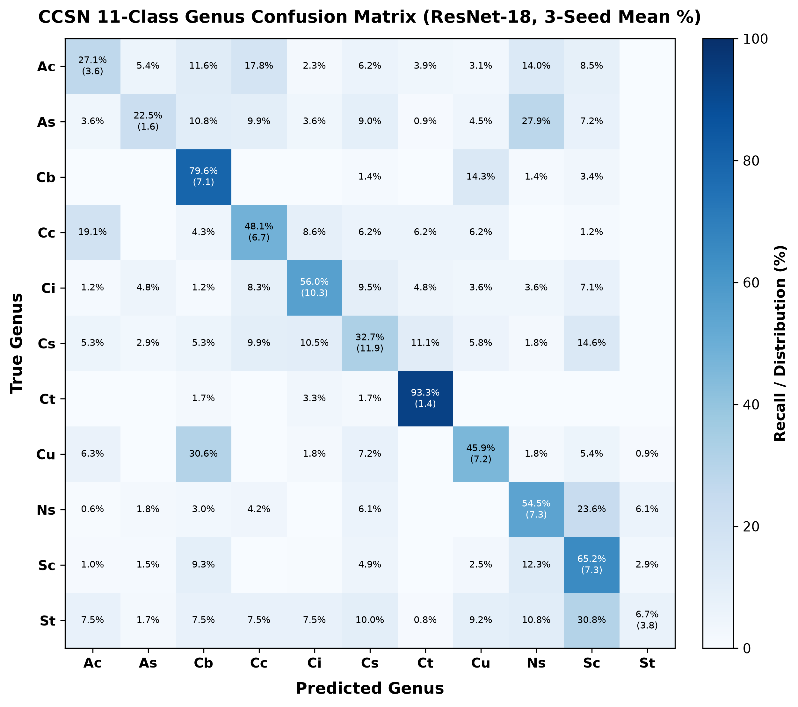

# CCSN 11-Class Genus Evaluation Report

## 1. Executive Summary

This report details the final 3-seed production training and evaluation of **ResNet-18** on the canonical **11-class CCSN genus taxonomy** (`metadata/splits/ccsn_11class_canonical.json`).

The evaluation adheres strictly to hold-out evaluation protocol: models are trained across seeds `{42, 43, 44}` on train (1,622 images) and validation (407 images) partitions, restoring the minimum validation loss checkpoint. The 508-image test partition is strictly isolated and evaluated only once per seed checkpoint.

## 2. Overall Performance Metrics (Held-out Test Split, N=508)

| Metric | 3-Seed Mean +/- SD | Seed 42 | Seed 43 | Seed 44 |
| :--- | :---: | :---: | :---: | :---: |
| **Top-1 Accuracy** | **49.34% +/- 2.53%** | 46.46% | 51.18% | 50.39% |
| **Top-3 Accuracy** | **78.48% +/- 0.69%** | 77.76% | 79.13% | 78.54% |
| **Macro-F1** | **45.82% +/- 3.08%** | 42.27% | 47.72% | 47.47% |

## 3. Hyperparameter Sweep & Tuning Provenance

- **Tuning Sweep Trials**: 10 trials (60 epochs each on Seed 42)
- **Winning Configuration**: Trial `trial_07_low_weight_decay` (AdamW + Low Weight Decay (1e-3))
- **Winning Hyperparameters**: LR Backbone: `5e-05`, LR Head: `0.0005`, Weight Decay: `0.001`, Label Smoothing: `0.1`
- **Validation Performance (Winner)**: Val Loss: `1.7078`, Top-1 Acc: `48.89%`, Top-3 Acc: `80.34%`, Macro-F1: `46.61%`

- **Config TOML**: `config/training/tuned_resnet18_ccsn11.toml`
- **Tuning Trajectory Log**: `artifacts/tuning/tuning_results_resnet18_ccsn11.json`

### 10-Trial Empirical Exploration Summary

| Trial ID | Configuration Name | Val Loss | Val Top-1 (%) | Val Top-3 (%) | Val Macro-F1 (%) |
| :--- | :--- | :---: | :---: | :---: | :---: |
| `trial_07_low_weight_decay` | AdamW + Low Weight Decay (1e-3) **(Winner)** | 1.7078 | 48.89% | 80.34% | 46.61% |
| `trial_10_optimal_differential` | Fine Differential LR (4e-5 / 4e-4, LS 0.05) | 1.6219 | 48.40% | 80.59% | 46.91% |
| `trial_05_sgd_conservative` | SGD with Momentum (Low LR) | 1.7459 | 46.93% | 77.89% | 45.09% |
| `trial_02_conservative_adamw` | Conservative AdamW (Low LR) | 1.7317 | 44.96% | 79.61% | 42.75% |
| `trial_09_heavy_dropout` | AdamW + Heavy Dropout (0.4/0.5) | 1.7455 | 47.17% | 80.84% | 45.12% |
| `trial_06_high_weight_decay` | AdamW + High Weight Decay (5e-2) | 1.7338 | 43.73% | 79.61% | 40.54% |
| `trial_08_no_label_smoothing` | AdamW + No Label Smoothing (0.0) | 1.5531 | 44.72% | 81.08% | 41.09% |
| `trial_04_sgd_momentum` | SGD with Momentum (Std LR) | 1.7654 | 46.44% | 78.87% | 45.22% |
| `trial_01_baseline_adamw` | Baseline AdamW (Std LRs) | 1.7507 | 44.96% | 79.61% | 41.32% |
| `trial_03_aggressive_adamw` | Aggressive AdamW (High LR) | 1.7824 | 45.21% | 79.61% | 43.56% |


## 4. Per-Genus Sensitivity / Recall Table

| Genus Code | Cloud Genus Name | Recall (3-Seed Mean +/- SD) | Seed 42 | Seed 43 | Seed 44 |
| :--- | :--- | :---: | :---: | :---: | :---: |
| `Ac` | Altocumulus | **27.13% +/- 3.55%** | 27.9% | 23.3% | 30.2% |
| `As` | Altostratus | **22.52% +/- 1.56%** | 21.6% | 24.3% | 21.6% |
| `Cb` | Cumulonimbus | **79.59% +/- 7.07%** | 71.4% | 83.7% | 83.7% |
| `Cc` | Cirrocumulus | **48.15% +/- 6.68%** | 42.6% | 46.3% | 55.6% |
| `Ci` | Cirrus | **55.95% +/- 10.31%** | 50.0% | 67.9% | 50.0% |
| `Cs` | Cirrostratus | **32.75% +/- 11.94%** | 19.3% | 36.8% | 42.1% |
| `Ct` | Contraila | **93.33% +/- 1.44%** | 92.5% | 95.0% | 92.5% |
| `Cu` | Cumulus | **45.95% +/- 7.15%** | 51.4% | 48.6% | 37.8% |
| `Ns` | Nimbostratus | **54.55% +/- 7.27%** | 47.3% | 61.8% | 54.5% |
| `Sc` | Stratocumulus | **65.20% +/- 7.25%** | 73.5% | 61.8% | 60.3% |
| `St` | Stratus | **6.67% +/- 3.82%** | 2.5% | 7.5% | 10.0% |

## 5. 11x11 Genus Confusion Matrix

The row-normalized confusion matrix (mean % across 3 seeds with sample standard deviation in parentheses) is rendered below:



## 6. Artifact Inventory & Cryptographic Checksums

| File | Description | SHA-256 Checksum |
| :--- | :--- | :--- |
| `resnet18_ccsn11_seed42.pth` | Frozen model checkpoint (Seed 42) | `946813edbc94fa5500415fc4f30f17b293a3ba3e804fd6f73ce143346f157555` |
| `predictions_seed42.npz` | Raw test predictions & logits (Seed 42) | `0839c54d81c39e60000e3d2a68a38508f59864a366e78c785e90d9fa92d42506` |
| `resnet18_ccsn11_seed43.pth` | Frozen model checkpoint (Seed 43) | `f03e34e8586dd601a874050f31222c915eed5c4d518de10e122811a4c53f25e0` |
| `predictions_seed43.npz` | Raw test predictions & logits (Seed 43) | `24655b388cab2beb691c73288e762bd85f809d3bafbe8a9e91f28af6bb31187a` |
| `resnet18_ccsn11_seed44.pth` | Frozen model checkpoint (Seed 44) | `969306efa3b3d6fa6c5e352788b5a64cb9aeb8db61860ba2a2511ba8731c01e5` |
| `predictions_seed44.npz` | Raw test predictions & logits (Seed 44) | `619328c67182010c5d20c15cfd89c4b883d9e852c6990b34a8d24056581c308d` |
| `cm_ccsn11_resnet18.png` | 11x11 Confusion Matrix Figure | `bfcd3af3ea8c0400330326eac3e9252d650a79d7d1d821e47f1cef39d6dab88e` |
| `ccsn11_evaluation_summary.json` | Complete Machine-readable Evaluation Results | `8ad4919b40591a49fa09cb6429362eea603bab53fcbcb3eb94f49498016a30e0` |

## 7. Exact Reproduction Commands

```powershell
# 1. Run 10-trial hyperparameter sweep (Seed 42, 60 epochs/trial)
python src/tune_resnet_family.py --model resnet18 --taxonomy ccsn11 --seed 42 --epochs 60

# 2. Train final model across 3 seeds with strict test split isolation
python scripts/train_ccsn_genus.py --config config/training/tuned_resnet18_ccsn11.toml --seeds 42 43 44

# 3. Evaluate frozen checkpoints on held-out test partition
python scripts/eval_ccsn_genus.py --config config/training/tuned_resnet18_ccsn11.toml --seeds 42 43 44
```
